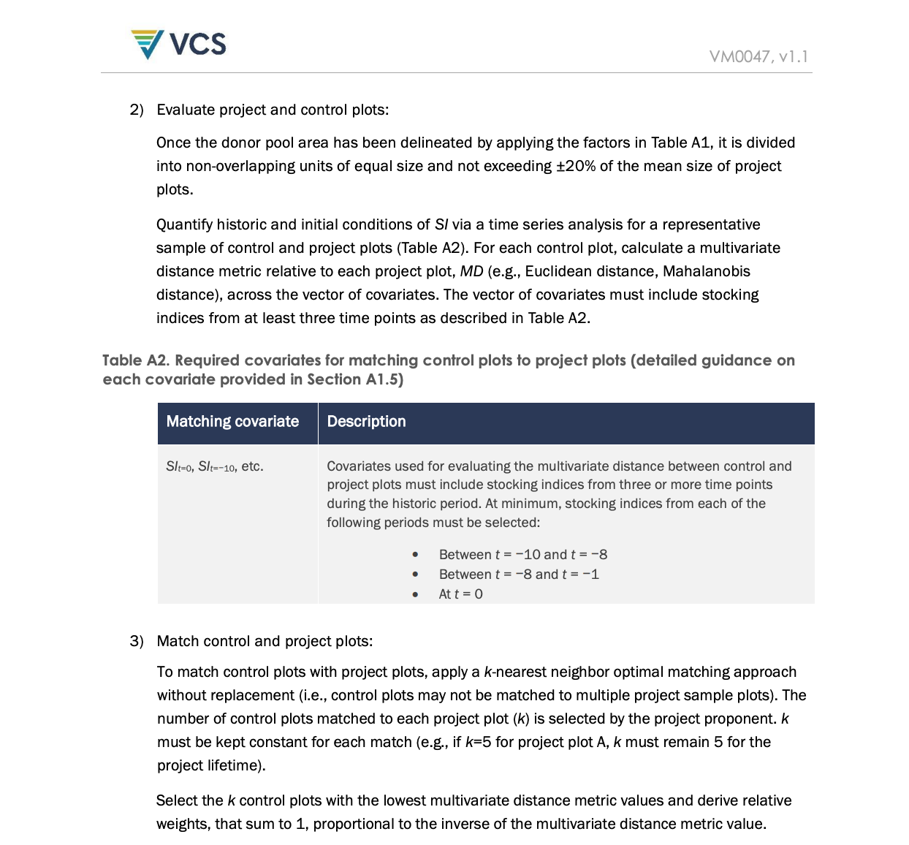

## PlotMatcherKNN: KNN Matching for ARR Projects

### 1. Background and Context

This library provides a tool for matching project plots with control plots, a crucial step in the quantification process for **Afforestation, Reforestation, and Revegetation (ARR)** projects under the **Verified Carbon Standard (VCS)**, specifically following **Verra Methodology VM0047**.

**The core challenge in ARR projects is to accurately quantify the carbon sequestration achieved *solely* due to the project's interventions.** This is vital for demonstrating additionality and ensuring that only genuinely additional emission reductions are credited.

To achieve this, methodologies like VM0047 often employ a **performance-based approach** or require robust baselining. A key technique for this is the **Area-Based Approach**, which relies on comparing project plots with carefully selected control plots.



**The Goal:**
*   **Project Plots:** Areas where ARR activities are implemented.
*   **Control Plots:** Areas that are NOT part of the project but share similar characteristics (environmental, geographical, policy-wise) to the project plots. These represent the "business-as-usual" scenario.

**The Matching Problem:**
Finding suitable control plots for each project plot is critical. This involves identifying control plots that closely resemble project plots in terms of historical conditions, particularly regarding vegetation growth, without being influenced by the project itself. This is where the K-Nearest Neighbors (KNN) algorithm is applied.

### 2. Key Definitions

*   **Afforestation, Reforestation, and Revegetation (ARR):** Refers to activities that establish, increase, or restore vegetative cover, typically forests, for carbon sequestration.
*   **Verified Carbon Standard (VCS) / Verra:** A leading standard for climate and sustainability commodity programs, providing a framework for verifying and issuing carbon credits.
*   **Methodology VM0047:** The specific Verra methodology for ARR projects, detailing how to quantify carbon sequestration, baselining, and additionality.
*   **Project Plot:** An area within the project boundary where ARR activities are undertaken and monitored.
*   **Control Plot:** An area outside the project boundary, selected to be as similar as possible to a project plot in terms of historical conditions, used for baseline estimation and performance comparison.
*   **Stocking Index (SI):** A metric derived from remote sensing data (e.g., NDVI, LiDAR-based canopy height) that is correlated with aboveground biomass and thus with carbon stocks. It's used as a proxy for vegetation growth and condition.
*   **Historical SI Values:** SI data from a period *before* the project commenced (typically 10 years prior to the project start date, `t=0`) used to establish baselines and for plot matching.
*   **Distance Metric:** A mathematical function used to quantify the similarity or dissimilarity between data points. In this context, it measures how similar a control plot's historical SI values are to a project plot's historical SI values. Common metrics include:
    *   **Euclidean Distance:** The straight-line distance between two points in feature space.
    *   **Mahalanobis Distance:** A more advanced metric that accounts for the correlation and variance of features, often preferred when features are correlated or have different scales.
*   **K-Nearest Neighbors (KNN):** A machine learning algorithm used for classification or regression. In this context, it's used to find the `k` data points (control plots) that are closest to a given data point (project plot) in the feature space.
*   **StandardScaler:** A data preprocessing technique that standardizes features by removing the mean and scaling to unit variance. This is often crucial for distance-based algorithms like KNN, especially when using Mahalanobis distance, to ensure features are on a comparable scale.

### 3. About the Code (`plot_matcher.py`)

This Python script provides a `PlotMatcherKNN` class designed to perform the critical task of matching project plots with control plots.

#### Key Features:

*   **K-Nearest Neighbors (KNN) Matching:** Implements the KNN algorithm to find the `k` most similar control plots for each project plot.
*   **Configurable Distance Metrics:** Supports both `euclidean` and `mahalanobis` distance metrics. `Mahalanobis` is often recommended as it accounts for feature correlations and scales, which is crucial when matching based on historical SI values over several years.
*   **Optional Data Scaling:** Includes an option to apply `StandardScaler` to the historical SI features. This is highly recommended, especially when using `mahalanobis` distance or if your SI features have significantly different scales, to ensure that all features contribute equally to the similarity calculation.
*   **Robust Input Handling:** Validates input DataFrames and column names to prevent common errors.
*   **Clear `fit-transform` Pattern:** Follows a standard machine learning workflow:
    *   **`fit(df_unlabeled, historical_cols, id_col_unlabeled)`:** This method learns the characteristics of the control plot pool, including preparing the data (scaling if enabled) and training the KNN model. It uses the `df_unlabeled` data to learn the underlying distributions and covariance (for Mahalanobis).
    *   **`find_matches(df_project_plots, df_control_plots, feature_cols, id_col_project, id_col_control)`:** This is the main method you'll call. It takes the project plots and the original control plots, then uses the model trained in `fit` to find the best matches. It handles data preparation for project plots and then performs the KNN search.
*   **Handles Original Data:** The class is designed to store the original, unprocessed DataFrames (`df_unlabeled_original`, `df_labeled_original`) so that the final output contains the original control plot data, with added columns for matching information (`Matched_PP_ID`, `distance_metric_value`), preserving the original `CP ID` and other features.
*   **Integer IDs:** Ensures that the `Matched_PP_ID` is correctly represented as an integer.

### 4. How to Use

1.  **Install Libraries:** Make sure you have the necessary libraries installed:
    ```bash
    pip install pandas numpy scikit-learn
    ```

2.  **Save the Code:** Save the Python code above into a file named `plot_matcher.py`.

3.  **Import the Class:** In your Jupyter notebook or main Python script:
    ```python
    from plot_matcher import PlotMatcherKNN
    import pandas as pd

    # Load your data (assuming pp and cp are your DataFrames, and historical_si_years is a list of column names)
    # Example:
    # pp = pd.read_csv('path/to/your/project_plots.csv')
    # cp = pd.read_csv('path/to/your/control_plots.csv')
    # historical_si_years = ['2015', '2016', ..., '2024'] # Adjust years based on your t=0 and data

    # --- Dummy data setup for demonstration ---
    # Replace this with your actual data loading
    data_pp = {'PP ID': [1, 2], '2015': [0.5, 0.6], '2016': [0.55, 0.62]}
    pp = pd.DataFrame(data_pp)
    data_cp = {'CP ID': [101, 102, 103, 104, 105], '2015': [0.51, 0.61, 0.70, 0.54, 0.66], '2016': [0.56, 0.63, 0.72, 0.57, 0.69]}
    cp = pd.DataFrame(data_cp)
    historical_si_years = ['2015', '2016']
    # --- End of Dummy data setup ---

    # 1. Initialize the matcher with your desired configuration
    #    Example: k=5, Mahalanobis distance, use scaler
    matcher = PlotMatcherKNN(
        k=5, 
        metric='mahalanobis', 
        use_scaler=True
    )

    # 2. Use find_matches to perform the entire process
    try:
        matches_df = matcher.find_matches(
            df_project_plots=pp,
            df_control_plots=cp,
            feature_cols=historical_si_years,
            id_col_project='PP ID',
            id_col_control='CP ID'
        )
        
        print("\n--- Final Matches Found ---")
        print(matches_df.head())

    except (KeyError, ValueError, RuntimeError) as e:
        print(f"An error occurred: {e}")

    # --- Alternative: Separate fit and transform ---
    # You can also fit the model first, then transform new data if needed.
    # try:
    #     print("\n--- Demonstrating separate fit and transform ---")
    #     matcher.fit(df_labeled=pp, df_unlabeled=cp, historical_si_cols=historical_si_years)
        
    #     # Now, you can transform the same data again, or new project plot data
    #     # For example, matching the same data:
    #     matches_df_again = matcher.transform(df_labeled_to_match=pp)
    #     print("\n--- Matches from transform() ---")
    #     print(matches_df_again.head())

    # except (KeyError, ValueError, RuntimeError) as e:
    #     print(f"An error occurred: {e}")
    ```

### 5. Example Notebook

For a practical demonstration of how to use this `PlotMatcherKNN` class, please refer to the example notebook:

*   **[`plot_matcher_usage_example.ipynb`](https://github.com/rizkiatthoriq/geographic-data-science/blob/main/KNN%20for%20Pairing%20Plots%20with%20Historical%20Values/plot_matcher_usage_example.ipynb)**

This notebook provides a step-by-step walkthrough with dummy data, illustrating how to load your DataFrames, initialize the `PlotMatcherKNN`, and interpret the results. It covers common scenarios and configurations.

### 6. Licence
This project is licensed under the MIT License - see the [LICENSE](https://github.com/rizkiatthoriq/geographic-data-science/blob/b3655e8d186b08136191c90f86c4849f9530b8b8/KNN%20for%20Pairing%20Plots%20with%20Historical%20Values/LISENCE) file for details.